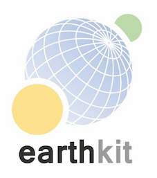

# earthkit

**DISCLAIMER**

> This project is **BETA** and will be **Experimental** for the foreseeable future. Interfaces and functionality are likely to change, and the project itself may be scrapped. **DO NOT** use this software in any project/software that is operational.

**earthkit** is a project led by ECMWF, providing powerful tools for speeding up weather and climate science workflows by simplifying data access, processing, analysis, visualisation and much more.

## Documentation

The documentation can be found at https://earthkit.readthedocs.io/.

## License

[Apache License 2.0](LICENSE) In applying this license, ECMWF does not waive the privileges and immunities
granted to it by virtue of its status as an intergovernmental organisation nor does it submit to any jurisdiction.
